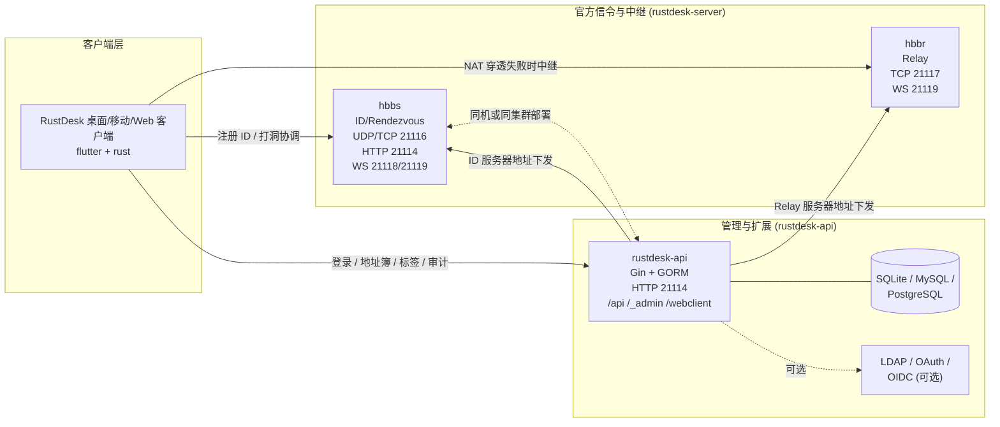

# 远程控制项目集 文档索引

## 总体介绍

本工作目录 `远程控制/` 集中了构建一个**完整、可自托管的 RustDesk 远程桌面系统**所需的三个核心项目：

- **rustdesk**：终端用户使用的远程桌面**客户端**（Rust + Flutter，覆盖 Windows / macOS / Linux / Android / iOS / Web）。
- **rustdesk-server**：官方开源的**信令与中继服务端**，由 `hbbs`（ID/Rendezvous）和 `hbbr`（Relay）两个 Rust 二进制组成，负责设备注册、NAT 穿透协调以及在 P2P 不通时进行流量中继。
- **rustdesk-api**（lejianwen）：基于 Go (Gin + GORM) 实现的**第三方 API 服务端 + Web 管理后台 + Web Client**，兼容官方 Pro API 协议，补齐用户/地址簿/权限/审计/OAuth/LDAP 等企业能力。

三者协作即可构成一个具备 **客户端 ⇄ 信令/中继 ⇄ 管理后台** 完整闭环的私有化远程桌面解决方案：客户端通过 hbbs 完成 ID 注册与打洞，必要时经 hbbr 中继；同时把账号、地址簿、登录态托管在 rustdesk-api 上，由 Web 管理后台统一治理。

## 三者关系示意



ASCII 备选视图：

```
                    +-----------------------------+
                    |       RustDesk 客户端        |
                    |   (rustdesk, Rust+Flutter)  |
                    +--+----------+-----------+---+
                       |          |           |
            ID 注册/打洞|   中继兜底|    登录/地址簿/管理
                       v          v           v
                +---------+  +---------+  +-------------+
                |  hbbs   |  |  hbbr   |  | rustdesk-api|
                | :21116  |  | :21117  |  |   :21114    |
                +----+----+  +----+----+  +------+------+
                     \\           /                |
                      \\_________/                 v
                       rustdesk-server        DB / LDAP / OAuth
```

## 各项目一句话总结

- [rustdesk](./rustdesk.md) — Rust + Flutter 实现的多平台远程桌面**客户端**，端到端 NaCl 加密，多进程架构（UI 进程 + `--server` 后台进程，IPC 走 Unix socket / 命名管道）。
- [rustdesk-server](./rustdesk-server.md) — 官方自托管**信令 (`hbbs`) + 中继 (`hbbr`)** 服务，Ed25519 身份验证 + SQLite 持久化 + 可选带宽治理，支持裸机 / Docker / systemd / Kubernetes 部署。
- [rustdesk-api](./rustdesk-api.md) — Go (Gin + GORM) 编写的**第三方 API + Web 管理后台 + Web Client**，兼容官方 Pro API，提供用户体系、地址簿、审计、LDAP/OAuth/OIDC 等企业级能力。
- [架构总览](./architecture.md) — 三个项目协同工作的端口、协议、数据流与典型部署拓扑。

## 快速上手建议

按"先跑通、再加管控"的顺序循序渐进：

1. **最小可用集（仅自建信令+中继，无账号体系）**
   - 部署 `rustdesk-server`：启动 `hbbs`（21116/UDP+TCP、21118/WS、21114/HTTP）与 `hbbr`（21117/TCP）。
   - 首次启动会在工作目录自动生成 `id_ed25519` / `id_ed25519.pub` 公私钥，**务必备份**，并把公钥下发给客户端。
   - 在 `rustdesk` 客户端的"ID/中继服务器"设置中填入 `hbbs` 地址与公钥，即可正常打洞 + 中继连接。

2. **加上管理后台（推荐用于多人/企业场景）**
   - 部署 `rustdesk-api`：默认监听 `21114`，通过环境变量将其指向 `hbbs` / `hbbr`：
     - `RUSTDESK_API_RUSTDESK_ID_SERVER=hbbs.example.com:21116`
     - `RUSTDESK_API_RUSTDESK_RELAY_SERVER=hbbs.example.com:21117`
     - `RUSTDESK_API_RUSTDESK_API_SERVER=http://api.example.com:21114`
     - `RUSTDESK_API_RUSTDESK_KEY=<hbbs 公钥>`
   - 首次启动会自动创建 `admin` 用户，**8 位随机密码打印在控制台日志**，注意截留。
   - 若希望"一次性"部署，可使用 `Dockerfile_full_s6`：用 s6-overlay 将 `rustdesk-api` 与 `hbbs/hbbr` 打包进同一容器，暴露 21114–21119。
   - 在 RustDesk 客户端配置中追加 API 服务器地址，PC 客户端即可登录并使用地址簿、标签、审计等能力。

3. **可选增强**
   - 数据库：默认 SQLite，业务量大时切到 MySQL / PostgreSQL（`RUSTDESK_API_GORM_TYPE`）。
   - 身份源：开启 LDAP/AD 或在 Web 后台动态配置 GitHub / Google / OIDC / Linuxdo。
   - 安全：开启 `BAN_THRESHOLD` IP 封禁、`CAPTCHA_THRESHOLD` 验证码、JWT (`JWT_KEY` 非空)，并设置 `GIN_TRUST_PROXY` 限定可信反代。
   - 强制中继：在 `hbbs` 设置 `ALWAYS_USE_RELAY=Y`，强制走 `hbbr` 以满足合规审计需求。

## 阅读顺序建议

为减少在 Rust / Go / Flutter 三种代码栈之间来回切换的成本，建议按下面的顺序阅读文档：

1. **[架构总览](./architecture.md)** — 先建立"客户端 / hbbs / hbbr / rustdesk-api"四方协作的整体心智模型，记住端口与协议矩阵（21114–21119）。
2. **[rustdesk-server](./rustdesk-server.md)** — 协议、端口与密钥体系的原点，篇幅适中，是理解后续两个项目的基础。
3. **[rustdesk](./rustdesk.md)** — 在已知协议基础上，从客户端视角阅读 `rendezvous_mediator` → `client` / `server` → `ipc` → Flutter UI 的链路。
4. **[rustdesk-api](./rustdesk-api.md)** — 最后阅读管理面：理解它如何**包裹**前两个项目（下发 ID/Relay 配置、托管账号与地址簿、兼容 Pro 协议）以及与 `lejianwen/rustdesk-server` 配套的差异化能力（强制登录、客户端 WebSocket 等）。

需要二次开发时建议沿着"客户端 FFI / 协议 → hbbs 路由 → rustdesk-api Service 层"自底向上修改，避免协议层与上层服务漂移。

## 数据来源

本索引基于本仓库三项目的整体侦察结果汇总而成。各项目分析覆盖的模块数量如下：

| 项目 | 已覆盖模块数 |
| --- | --- |
| rustdesk | 14 |
| rustdesk-server | 14 |
| rustdesk-api | 0（基于整体结构与配置/入口/部署等横向调研归纳） |

详细的模块清单、入口文件、配置项、外部依赖与值得注意的设计点见各子文档：
[rustdesk.md](./rustdesk.md)、[rustdesk-server.md](./rustdesk-server.md)、[rustdesk-api.md](./rustdesk-api.md)、[architecture.md](./architecture.md)。
