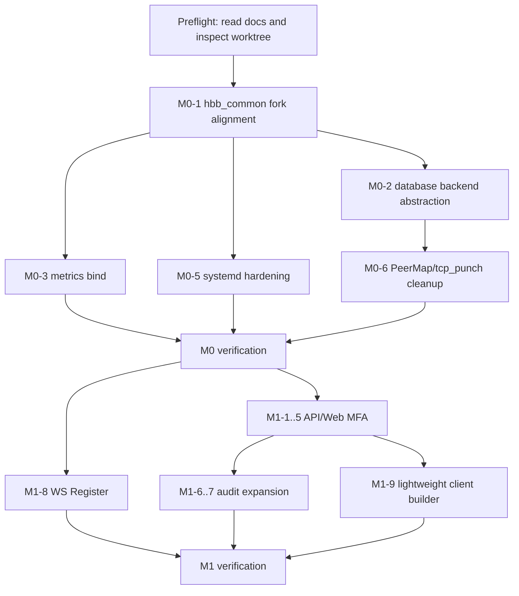

# AI 执行开发规划

> 面向对象:后续直接动手开发的 AI agent。
> 上游规划:以 `docs/upgrade-plan.md` 为产品/路线图来源。
> 工作范围:`rustdesk-server/`、`rustdesk-api/`、`rustdesk/` 三个项目就地修改。
> 第一目标:先完成 M0 + M1,并保持老客户端/老服务端兼容。
>
> **实施级规格**:本规划的 16 个 CE 任务卡已逐个细化为可直接交付的实施规格,位于 `docs/ai-tasks/`。接到任何 CE-Mx-y 任务时,先读 `docs/ai-tasks/README.md`(索引 + 跨任务约定)与对应的 `docs/ai-tasks/CE-Mx-y.md`,再回到本文件查阶段全局约束(§1 总原则 / §7 验证矩阵 / §9 禁止事项)。

---

## 0. 执行前必须读

开始任何代码改动前,先读以下文件并只按当前仓库事实行动:

1. `docs/upgrade-plan.md`
2. `docs/architecture.md`
3. `docs/rustdesk-server.md` 的安全与核心模块章节
4. `docs/rustdesk-api.md` 的路由、模型、迁移、鉴权章节
5. `docs/rustdesk.md` 的 `auth_2fa`、`custom_server`、审计与 `hbb_common` 章节

然后用命令核实当前工作树:

```bash
git status --short
git -C rustdesk-server submodule status
git -C rustdesk submodule status
git -C rustdesk-api status --short
```

如果发现已有未提交改动,不要回滚。先判断是否与当前任务相关;相关则兼容它,不相关则绕开。

---

## 1. 总原则

### 1.1 兼容性优先

- 所有 protobuf 新字段必须是 `optional` 或等价的向后兼容追加字段。
- 老客户端连接新服务端、新客户端连接老服务端都必须能握手。
- 禁止重排或复用现有 protobuf field number。
- `rustdesk-api` 没有 `hbb_common` submodule,只同步 API DTO / OpenAPI 语义。

### 1.2 不重复造已有能力

- 客户端已有本机会话级 TOTP 2FA,本计划要做的是 API/Web 账号 MFA。
- `rustdesk-api` 已有 `/api/audit/conn` 和 `/api/audit/file`,不要删除或替换。新增剪贴板/告警审计时,保留现有 `AuditConn` / `AuditFile` 兼容面。
- RustDesk 客户端已支持文件名 Configuration String。轻量 Client Builder 只需要生成正确文件名和下载页,不要在 M1 做全平台编译。

### 1.3 安全边界

- `mfa_ticket` 只能短期有效,只放内存,不要写入 `LocalConfig`。
- RBAC 的 hbbs 强制检查必须基于客户端 token 解析出的用户,不能只信 `from_peer`。
- Redis 缓存 key 必须包含 user/from/to/action,避免跨用户污染。
- GeoLite2 数据库不随项目默认分发,只支持管理员通过路径提供。
- metrics 不占用 21114,使用显式 `--metrics-bind` 独立 loopback 端口。

### 1.4 交付习惯

- 每个 CE 任务尽量小步提交,提交信息前缀使用 `[CE-Mx]`。
- 代码改动必须同步更新文档与最小验证命令。
- 若一个任务触及多个仓库,先写清楚跨仓库接口,再实现。

---

## 2. 仓库责任图

| 仓库 | 主要职责 | 本阶段重点 |
|------|----------|------------|
| `rustdesk-server` | hbbs/hbbr 信令、中继、PeerMap、relay 选择、管理 CLI | M0 基建、安全加固、WS 注册补齐 |
| `rustdesk-api` | API/Web Admin、用户、地址簿、审计、OAuth/LDAP、Web Client | API/Web 账号 MFA、审计扩展、轻量 Client Builder |
| `rustdesk` | 桌面/移动客户端、被控端服务、Flutter UI、配置解析、审计上报 | API MFA UI、审计事件上报、后续策略落地 |

---

## 3. 推荐开发顺序

不要直接跳到 M2/M3。先完成 M0 的可构建基础,再做 M1 的用户可见功能。



---

## 4. M0 任务卡

### CE-M0-1 hbb_common fork 对齐

目标:
- `rustdesk-server` 与 `rustdesk` 都指向自管 `hbb_common-ce`。
- 记录并解释当前 pin 差异:`rustdesk-server=83419b6`,`rustdesk=a920d00`。
- 不要假设 `rustdesk-api` 有 submodule。

执行步骤:
1. 查看两个 Rust 仓库的 `.gitmodules` 和 `git submodule status`。
2. 建议先做 zero-change fork 对齐,不要同时改协议。
3. 在文档中记录选定基线、原因、兼容测试方法。

验收:

```bash
git -C rustdesk-server submodule status
git -C rustdesk submodule status
git -C rustdesk-api submodule status
```

最后一条允许为空,但文档必须说明这是预期。

### CE-M0-2 hbbs PostgreSQL 后端

目标:
- `rustdesk-server/src/database.rs` 抽象出后端接口。
- 保留 SQLite 默认行为。
- 增加 PostgreSQL 后端,连接池默认上限可从 1 提升到 32。

执行步骤:
1. 先读 `database.rs` 当前 schema 与调用点。
2. 引入最小 trait 或 enum,不要大规模重写 PeerMap。
3. 所有 SQL 字段与 SQLite 语义保持一致。
4. 配置仍支持现有 `DB_URL`,新增 Postgres DSN 解析时保持向后兼容。

验收:

```bash
cd rustdesk-server
cargo check
cargo test database
```

如果子模块未初始化导致无法构建,记录原因并给出可复现初始化命令。

### CE-M0-3 metrics 独立端口

目标:
- hbbs/hbbr 暴露 Prometheus metrics。
- 使用 `--metrics-bind 127.0.0.1:<port>` 或等价配置。
- 不占用 21114。

建议指标:
- hbbs:在线 peer 数、PeerMap 内存条目数、注册请求数、打洞请求数、relay 分配数、API access check 延迟。
- hbbr:当前 session 数、bytes in/out、配对超时数、限速命中数。

验收:

```bash
curl http://127.0.0.1:<hbbs_metrics_port>/metrics
curl http://127.0.0.1:<hbbr_metrics_port>/metrics
```

### CE-M0-4 rustdesk-api Redis / metrics healthcheck

目标:
- Redis 是可选增强,不要默认强依赖。
- 增加启动时 healthcheck 与清晰错误日志。
- API metrics 与 tracing 为后续 RBAC/MFA/Audit 排障服务。

执行步骤:
1. 读 `config/redis.go`、`config/cache.go`、`lib/cache/*`。
2. 确认当前缓存类型配置方式。
3. 增加 healthcheck 但不要让默认 SQLite/内存缓存部署启动失败。

验收:

```bash
cd rustdesk-api
go test ./...
go test ./lib/cache ./utils
```

### CE-M0-5 systemd 加固

目标:
- hbbs/hbbr 以专用 `rustdesk` 用户运行。
- 加入 `ProtectSystem=strict`、`NoNewPrivileges=true`、`ReadWritePaths=/var/lib/rustdesk-server`。
- `postinst` 创建用户与目录权限。

注意:
- 确保密钥、数据库、日志目录仍可写。
- 不要破坏 FreeBSD rc.d / Docker 现有路径。

验收:

```bash
systemd-analyze security rustdesk-hbbs.service
systemd-analyze security rustdesk-hbbr.service
```

### CE-M0-6 PeerMap GC 与 tcp_punch key

目标:
- PeerMap 后台 GC 每 60 秒清理过期条目。
- `tcp_punch` key 从 IP 改为 `(ip, port, peer_id)` 或等价结构。
- 给 `tcp_punch` sink 加 TTL,避免长期驻留。

执行步骤:
1. 先读 `rustdesk-server/src/peer.rs` 与 `src/rendezvous_server.rs`。
2. 用类型封装 key,避免字符串拼接。
3. 注意 NAT 后多设备共享 IP 的场景。

验收:

```bash
cd rustdesk-server
cargo test peer
cargo test rendezvous
```

### CE-M0-7 管理 CLI 改 UDS + token

目标:
- loopback 管理 CLI 改为 Unix domain socket。
- socket 文件权限 `0660`。
- token 启动时打印到 stderr 或写入仅 root/rustdesk 可读文件。

注意:
- hbbs 与 hbbr 都要处理。
- macOS/Linux 行为可能不同,Windows 需要保留旧路径或明确不支持。

验收:
- 本机普通用户无法调用管理命令。
- `rustdesk` 用户或 root 可以调用。

---

## 5. M1 任务卡

### CE-M1-1 数据模型:user_mfa

目标:
- `rustdesk-api/model/user_mfa.go`
- 字段:`user_id`、`secret`、`recovery_codes` JSON、`enabled_at`、`last_used_at`、`created_at`、`updated_at`。
- `DatabaseVersion` 从 265 bump 到 266。

要求:
- Secret 加密或至少使用现有敏感字段处理方式。
- Recovery code 只存 hash,不要明文存储。
- AutoMigrate 不够时补手写迁移。

验收:

```bash
cd rustdesk-api
go test ./model ./service
```

### CE-M1-2 MFA service

目标:
- `service/mfa.go`
- 使用 `github.com/pquerna/otp/totp`。
- 提供 enroll、verify、recovery code consume、disable。

接口建议:
- `Enroll(userId uint) (secret string, qrPNG []byte, err error)`
- `Verify(userId uint, code string) (bool, error)`
- `GenerateRecoveryCodes(userId uint) ([]string, error)`
- `ConsumeRecoveryCode(userId uint, code string) (bool, error)`

验收:
- 单元测试覆盖正确 TOTP、错误 TOTP、过期 ticket、一次性 recovery code。

### CE-M1-3 两步登录状态机

目标:
- `/api/login` 首步校验账号密码。
- 如果用户启用 MFA,返回 `{ "mfa_required": true, "ticket": "<short_jwt>" }`。
- `/api/login-mfa` 校验 ticket + code 后返回现有 token 响应。

安全要求:
- ticket 有效期建议 3 到 5 分钟。
- ticket 绑定 user id、client ip 或 device id。
- 密码错误仍走现有 limiter/captcha/ban 流程。
- MFA 错误也应计入 limiter 或至少单独限流。

兼容要求:
- 未启用 MFA 的用户登录响应不破坏旧客户端。
- 新响应字段必须能被旧客户端忽略。

### CE-M1-4 客户端 API MFA UI

目标:
- RustDesk 登录 rustdesk-api 时识别 `mfa_required`。
- 弹出 TOTP 输入。
- `mfa_ticket` 只存在当前登录流程内存中。

不要做:
- 不要改已有被控端本机 `auth_2fa.rs` 语义。
- 不要把 API MFA ticket 写入 `LocalConfig`。

验收:
- 未开启 MFA 的登录流程保持原样。
- 开启 MFA 的账号必须输入正确 TOTP 才能拿 token。

### CE-M1-5 后台强制 MFA

目标:
- 后台用户/组配置支持强制 MFA。
- 强制后,未 enroll 的用户登录应进入 enroll 或被拒绝,具体策略写入文档。

建议:
- 先支持 user-level 强制,再扩 group-level。
- 管理员禁用用户 MFA 必须有审计日志。

### CE-M1-6 审计事件扩展

目标:
- 保留 `AuditConn` / `AuditFile`。
- 新增剪贴板、告警等事件类型,可用新表 `AuditEvent` 或统一视图。
- 后台 list 支持事件类型过滤。

建议模型:

```text
audit_event:
  id
  kind              # clipboard | alarm | cmd | record | ...
  peer_id
  from_peer
  from_name
  session_id
  ip
  payload_json
  created_at
```

兼容要求:
- `/api/audit/file` 继续工作。
- `/admin/audit_file/list` 继续工作。

### CE-M1-7 客户端审计上报

目标:
- 文件传输复用 `/api/audit/file`。
- 剪贴板/告警走新事件端点或统一视图。
- 上报失败不能阻塞远控会话。

上报点:
- 文件发送/接收开始、成功、失败。
- 文本剪贴板同步。
- 文件剪贴板同步。
- 连接被策略拒绝、异常断开、长时间 relay。

### CE-M1-8 WS Register 补齐

目标:
- `rendezvous_server.rs::handle_listener2` 支持 `RegisterPeer` / `RegisterPk`。
- WS binary frame 内容仍是原 RendezvousMessage。

注意:
- 不能绕过 IP blocker / uuid check / pk update 逻辑。
- 复用 UDP/TCP 已有处理函数,不要复制一份分叉逻辑。

验收:
- WS-only 客户端能独立注册。
- 旧 TCP/UDP 注册流程不变。

### CE-M1-9 轻量 Client Builder

目标:
- rustdesk-api 后台新增轻量 client builder。
- 管理员填写 id-server、relay-server、api-server、key。
- 生成 Windows portable EXE 下载链接,文件名类似:

```text
RustDesk-host=id.example.com,key=<base64>,api=https://api.example.com,relay=relay.example.com.exe
```

要求:
- key 字段按 RustDesk 客户端现有解析规则处理。
- 下载的上游 artifact 必须有版本和校验信息。
- 生成下载页和二维码。
- 不在 M1 做全平台编译、不改 icon、不做签名。

### CE-M1-10 运维文档

新增:
- `docs/operations/2fa.md`
- `docs/operations/audit-events.md`

内容:
- 配置项。
- API 示例。
- 常见故障。
- 回滚方式。
- 验收步骤。

---

## 6. M2 预研接口

M1 完成前不要大规模实现 M2,但可以预留接口。

### RBAC v2

API 侧模型:
- `admin_role`:后台管理权限。
- `control_role`:远控会话内权限,如 connect/file/clipboard/audio/input/view_only。
- `access_policy`:主体到客体的访问规则。
- `time_window`:访问时段。

hbbs 强制检查:

```http
POST /api/access/check
Authorization: Bearer <client-token>
Content-Type: application/json

{
  "from_peer": "controller-peer-id",
  "to_peer": "host-peer-id",
  "action": "connect"
}
```

响应:

```json
{ "allow": true, "reason": "", "policy_id": 123 }
```

缓存 key:

```text
access:<user_id>:<from_peer>:<to_peer>:<action>
```

### Policy Sync

proto 主通道只放摘要:

```text
PolicyDigest:
  policy_id
  version
  hash
  deny_flags
```

完整策略走 API:

```http
GET /api/policy/effective?peer_id=<id>
Authorization: Bearer <client-token>
```

### GeoIP Relay

实现要求:
- `-g` 指定 MaxMind DB 路径。
- 没有 DB 时回退 round-robin。
- 不随代码库分发 GeoLite2。
- relay 列表需要能配置 region/country/lat/lon,不能只靠 DNS 名称猜测。

---

## 7. 验证矩阵

每个 milestone 至少跑以下矩阵。

| 场景 | 命令/方式 | 通过标准 |
|------|-----------|----------|
| rustdesk-api 单测 | `go test ./...` | 全绿或记录已知失败 |
| rustdesk-server 编译 | `cargo check` | 无编译错误 |
| rustdesk-server 单测 | `cargo test` | 全绿或记录已知失败 |
| rustdesk 客户端编译 | `cargo check` / 项目既有构建脚本 | 无协议/类型错误 |
| API 登录兼容 | MFA off 登录 | 响应与旧流程兼容 |
| API MFA | MFA on 登录 | 必须二次校验 |
| WS Register | WS-only register peer | hbbs PeerMap 可见 |
| Audit file | `/api/audit/file` | 旧接口仍可写入/查询 |
| Client Builder | 下载文件名解析 | 客户端启动后 server/key/api 正确 |
| Metrics | `curl /metrics` | 指标非空且不占 21114 |

如果因为平台依赖无法运行某项,必须在最终说明中写明未验证原因和替代检查。

---

## 8. AI agent 工作模板

每次接到一个 CE 任务,按这个格式执行。

```text
任务:
  CE-Mx-y <标题>

先读:
  - 相关 docs
  - 目标仓库的入口文件
  - 目标模块现有测试

实现:
  1. 最小范围修改
  2. 增加或更新测试
  3. 更新 docs/operations 或 upgrade-plan 状态

验证:
  - 列出实际运行的命令
  - 列出未运行的命令及原因

最终输出:
  - 改了哪些文件
  - 行为变化
  - 兼容性说明
  - 下一步建议
```

---

## 9. 禁止事项

- 不要把 `rustdesk-api` 当成有 `hbb_common` submodule 的 Rust 项目。
- 不要删除或替换现有 `/api/audit/file`。
- 不要把 API MFA ticket 持久化。
- 不要把 GeoLite2 数据库提交进仓库。
- 不要让 metrics 默认抢占 21114。
- 不要在 M1 做完整客户端编译农场。
- 不要在未验证旧客户端兼容前修改 protobuf required/oneof 语义。
- 不要把 `from_peer` 当成可信身份来源。

---

## 10. 完成定义

M0 完成:
- 两个 Rust 仓库的 `hbb_common` 治理清晰。
- hbbs PostgreSQL 后端可配置且 SQLite 默认可用。
- hbbs/hbbr metrics 可抓取。
- systemd 加固不破坏运行。
- PeerMap/tcp_punch/管理 CLI 风险有明确修复。

M1 完成:
- API/Web 账号 MFA 可用。
- 审计扩展不破坏旧连接/文件审计。
- WS-only 注册可用。
- 轻量 Client Builder 可生成可用 Windows portable EXE 下载链接。
- 运维文档可让新部署者独立配置和回滚。

M2 才允许宣称:
- RBAC 在 API 可见性与 hbbs 信令层双层生效。
- 策略可下发并被客户端执行。
- GeoIP relay 可配置、可观测、可回退。

