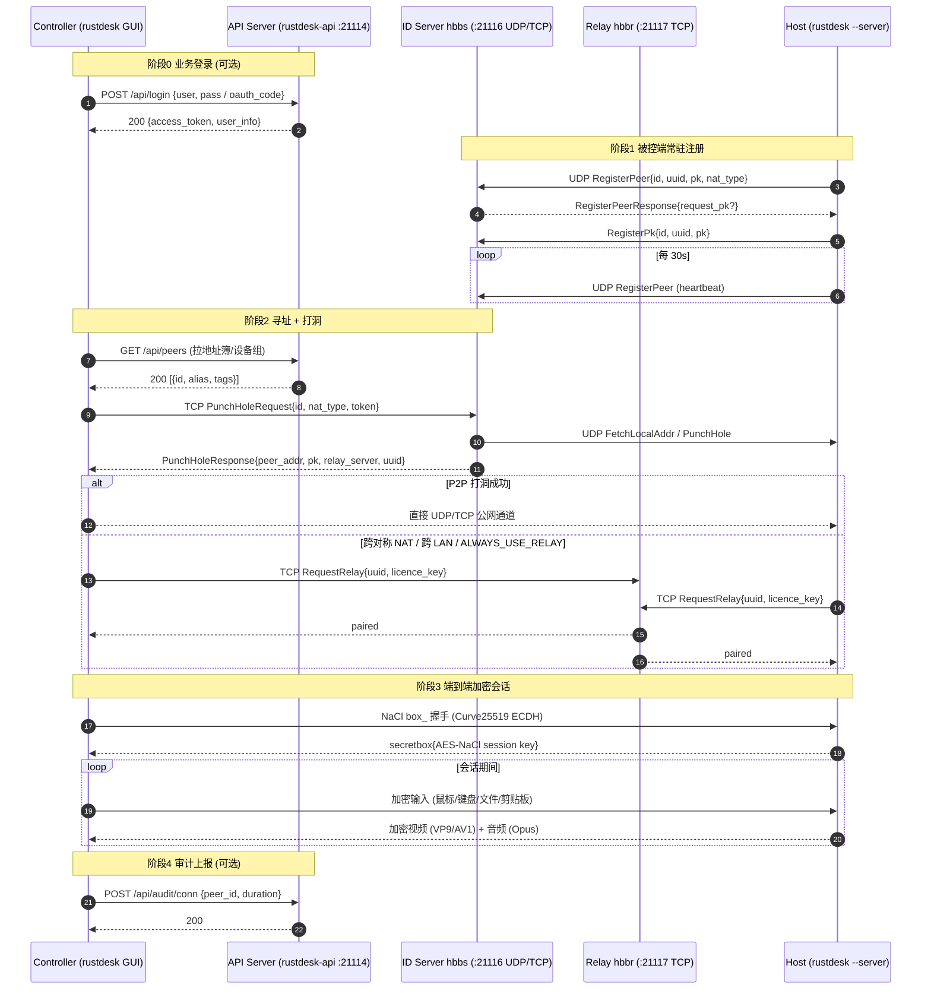
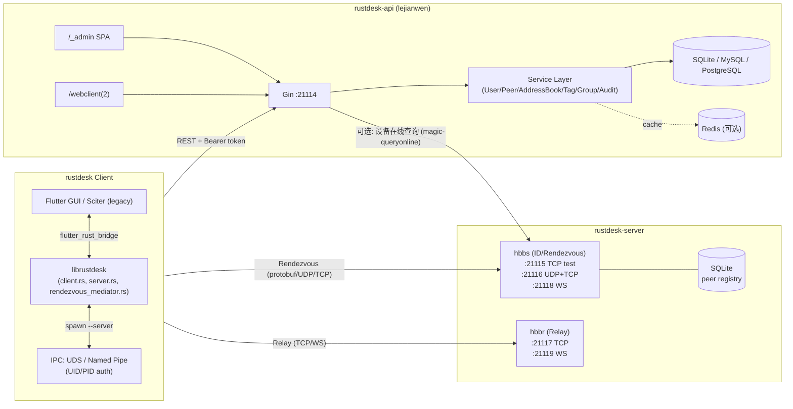
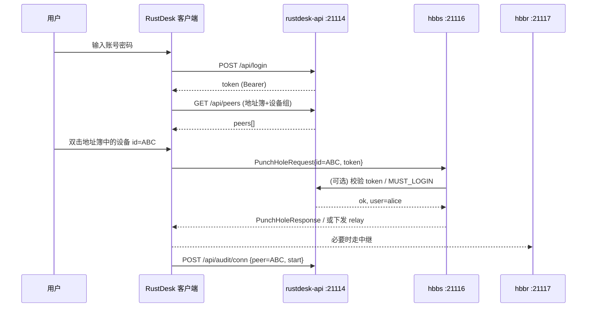
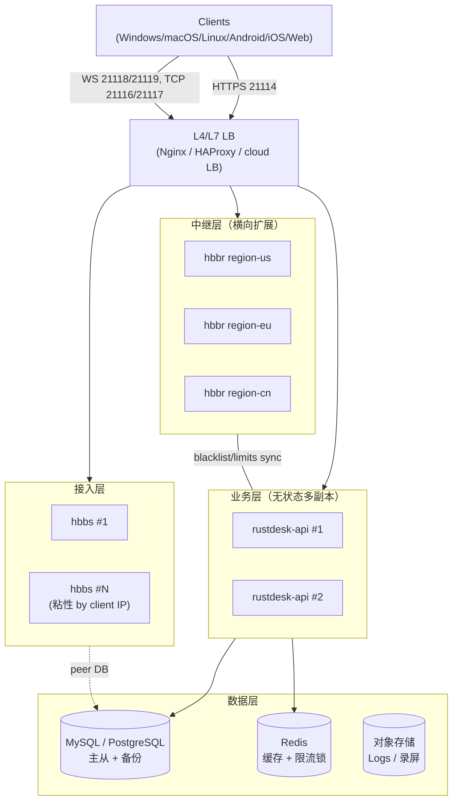

# RustDesk 三项目协同架构详解

> 适用范围：`rustdesk` (客户端) · `rustdesk-server` (hbbs + hbbr) · `rustdesk-api` (lejianwen, 第三方 API/管理后台)
> 文档版本：2026-06-27

---

## 1. 总览：四角色与三项目的映射

虽然名义上只有 3 个项目，但运行态实际是 **4 个角色** 协同工作：

| 角色 | 进程 | 所在项目 | 编程语言 | 一句话职责 |
|------|------|---------|---------|------------|
| **Client** | `rustdesk` / `rustdesk --server` | rustdesk | Rust + Flutter | 桌面侧 GUI 控制端 / 被控端主机服务 |
| **ID Server (Rendezvous)** | `hbbs` | rustdesk-server | Rust | 设备 ID 注册、心跳、NAT 打洞协调、签发 Relay 凭证 |
| **Relay Server** | `hbbr` | rustdesk-server | Rust | 在 P2P 打洞失败时，把双方加密流量中继转发 |
| **API Server** | `rustdesk-api` (`apimain`) | rustdesk-api | Go (Gin + GORM) | PC 客户端登录/地址簿/设备组/审计；Web Admin；Web Client；OAuth/LDAP；签发 token |

设计上 hbbs/hbbr 只负责传输层（信令 + 中继），**完全不感知用户身份、地址簿、设备组等业务概念**。所有业务态由 API Server 承载，客户端在 hbbs 之外另起 HTTPS 连接和 API Server 通信，再把得到的 token 以 `Authorization: Bearer` 方式带回到 hbbs/hbbr 的握手中。

---

## 2. 端到端通信流程

### 2.1 五个关键阶段

1. **客户端登录 API**（可选，决定能否使用地址簿/设备组/SSO）
   - 客户端使用账号密码 / OAuth / LDAP 调用 `POST /api/login`
   - API Server 返回 access token，写入本地 `LocalConfig`
   - 后续所有 PC 端协议接口都带 `Authorization: Bearer <token>`，命中 `RustAuth` 中间件

2. **ID 注册 + 心跳**（hbbs · UDP 21116）
   - 被控端启动 `--server` 后，`rendezvous_mediator.rs` 周期性向 hbbs 发送 `RegisterPeer` (protobuf)
   - hbbs 把 `id / uuid / pk / 外网地址 / NAT 类型` 写入内存 PeerMap（冷数据 fallback 到 SQLite）
   - 默认 30 秒一次心跳，hbbs 据此判断设备是否在线

3. **寻址 + 打洞**（hbbs · UDP/TCP 21116）
   - 控制端发起 `PunchHoleRequest(id)`：hbbs 查 PeerMap，得到被控端的公网 endpoint
   - hbbs 同时向控制端回 `PunchHoleResponse`、向被控端推 `FetchLocalAddr` / `PunchHole`，双方按同一时间窗向对方公网地址打洞
   - 若 NAT 类型对称、或跨 LAN (`--mask` 判定为不同子网) 且 `ALWAYS_USE_RELAY=Y`，hbbs 跳过打洞，直接走中继分支

4. **中继中转**（hbbr · TCP 21117）
   - hbbs 给双方下发同一个 `RequestRelay.uuid` 与 relay server 地址（`-r/--relay-servers` 列表中选）
   - 双方都向 hbbr 21117 建 TCP 连接，按 uuid 配对；30s 未配对则丢弃
   - hbbr 不解密载荷，仅做字节级双向 splice，并受 `SINGLE_BANDWIDTH / TOTAL_BANDWIDTH / DOWNGRADE_THRESHOLD` 限速

5. **端到端加密会话**（无服务器参与）
   - 双方使用 NaCl `box_` (Curve25519 ECDH) 协商对称密钥，载荷使用 XSalsa20-Poly1305 (`secretbox`) 加密
   - 公钥来源：hbbs 上注册的 `pk`，由 hbbs 用 Ed25519 私钥 (`id_ed25519`) 签名背书
   - 后续视频 (VP8/VP9/AV1/H.264/H.265)、音频 (Opus)、文件传输、剪贴板、终端、端口转发等都跑在这条加密通道上

### 2.2 Mermaid 时序图



### 2.3 鉴权链路

- **传输层**：hbbs/hbbr 共用 `-k/--key`。若 `ENCRYPTED_ONLY=1` 或 `-k _`，自动用启动时生成的 `id_ed25519` 私钥签名所有下发给客户端的 `pk`，客户端用 `id_ed25519.pub` 校验，防止中间人替换设备公钥。
- **应用层**：客户端 → API Server 用账号密码或 OAuth 换取 token；token 通过 `RustAuth` 中间件做数据库表查（若 `RUSTDESK_API_JWT_KEY` 非空再叠加 JWT 校验）。Web Admin 用独立的 `api-token` header + `BackendUserAuth`。
- **端到端**：会话密钥由 Curve25519 ECDH 协商，hbbs/hbbr 全程拿不到明文。

---

## 3. 四角色职责分离



| 维度 | hbbs | hbbr | rustdesk Client | rustdesk-api |
|------|------|------|----------------|---------------|
| 状态机 | PeerMap (id→endpoint+pk) | uuid→peer pair 配对表 | Session/Connection 状态 | 业务实体 CRUD |
| 持久化 | SQLite (peer 表) | 无（内存 + blacklist 文件） | 本地 LocalConfig + PeerConfig | DB (User/AddressBook/Audit/...) |
| 协议 | Hbb Rendezvous Protocol (protobuf) | Hbb Relay Protocol (protobuf) | 同左两者 + 私有媒体流 | RESTful JSON (兼容官方 Pro API) |
| 端口 | 21115/21116/21118 | 21117/21119 | 出向：21114/21116/21117 | 21114 |
| 鉴权 | Ed25519 PK + `--key` | 同左 `--key` | API token + 设备密码/永久密钥 | bcrypt + token/JWT + OAuth/LDAP |
| 可水平扩展 | 单机为主（共享 SQLite 难） | 是（`-r` 列表） | N/A | 是（DB + Redis 共享） |

---

## 4. 端口矩阵

| 端口 | 协议 | 进程 | 用途 | 备注 |
|------|------|------|------|------|
| **21114** | TCP | hbbs / rustdesk-api | hbbs 内部 HTTP API（环回管理 CLI）/ rustdesk-api 主监听 | 端口 = `RENDEZVOUS_PORT − 2`。在自托管部署中 21114 通常被 rustdesk-api 接管 |
| **21115** | TCP | hbbs | NAT 类型检测（TCP test） | `RENDEZVOUS_PORT − 1`，客户端用它判断对称/锥形 NAT |
| **21116** | **UDP + TCP** | hbbs | ID 注册、心跳、打洞信令、寻址 | `RENDEZVOUS_PORT`，**核心端口**。UDP 心跳，TCP 用于 PunchHole/Login |
| **21117** | TCP | hbbr | Relay 中继转发 | `RELAY_PORT`，加密流量盲转 |
| **21118** | TCP (WebSocket) | hbbs | hbbs 的 WebSocket 信令 | 给 Web Client 或反向代理穿透用；`RENDEZVOUS_PORT + 2` |
| **21119** | TCP (WebSocket) | hbbr | hbbr 的 WebSocket 中继 | `RELAY_PORT + 2`；同时 hbbs 用 `21116 + 3 = 21119` 做 LAN 发现（UDP） |
| 21114 (内部) | TCP | hbbs | 管理 CLI (loopback only) | `relay-servers / ip-blocker / always-use-relay / test-geo` 等命令 |
| 21117 (内部) | TCP | hbbr | 管理 CLI (loopback only) | `blacklist / blocklist / limit-speed / total-bandwidth / usage` |

> 部署提醒：当 rustdesk-api 与 hbbs 同机部署时，hbbs 的内部 HTTP API 端口 (21114) 与 rustdesk-api 监听冲突——这是 `Dockerfile_full_s6` 把所有进程打包在一个容器并由 s6 编排的原因，hbbs 的内部 API 仅做环回，不对外暴露。

UDP/TCP/WS 速查：

- **UDP**：21116 (注册/心跳/打洞), 21119 (LAN 发现)
- **TCP**：21115 (NAT 测试), 21116 (信令登陆备份), 21117 (Relay), 21114 (API)
- **WebSocket**：21118 (hbbs), 21119 (hbbr) — 反向代理 / 浏览器 Web Client 走这两个

---

## 5. 第三方 rustdesk-api 与官方 server 的协同

### 5.1 协同点

1. **客户端配置注入**：客户端启动时通过 `custom-rendezvous-server` 指向 hbbs；通过 `api-server` 指向 rustdesk-api。两者**独立配置、独立部署**，但客户端用同一份 key 校验 hbbs/hbbr。
2. **token 互通**：客户端登录 rustdesk-api 拿到 token；后续 `PunchHoleRequest` 会携带该 token（官方 Pro 协议字段 `token`），hbbs 在 `MUST_LOGIN=Y` 模式下会反向调用 API Server 校验。lejianwen 推荐使用其同名 `lejianwen/rustdesk-server` fork，原因正是修复了官方版本"反向 API 链接超时"的问题。
3. **Web Client / WebClient V2**：`/webclient` 与 `/webclient2` 是 API Server 内嵌的浏览器 RustDesk 客户端，通过 hbbs/hbbr 的 WebSocket 端口 (21118/21119) 连接信令和中继，使用 `RUSTDESK_API_RUSTDESK_WS_HOST` 显式声明 WS 入口。
4. **设备组 / 地址簿 / 标签**：仅存在于 API Server 的 DB 中。客户端 `flutter/lib` 通过 `/api/ab/*`、`/api/peers`、`/api/tags` 等接口拉取，hbbs 完全无感。
5. **审计 / 共享记录 / 服务端命令**：客户端会话事件通过 `/api/audit/*`、`/api/share_record/*` 上报；管理员还可通过 `ServerCmd` 服务下发指令到客户端（如强制更新配置、强制注销）。
6. **在线状态同步**：API Server 通过 `RUSTDESK_API_RUSTDESK_WEBCLIENT_MAGIC_QUERYONLINE` 调用 hbbs（或 hbbs fork 暴露的接口）查询设备在线情况，呈现在 Web Admin。

### 5.2 客户端配置示例

```ini
# rustdesk 客户端 → 同时填三项才能完整启用 lejianwen 生态
custom-rendezvous-server = id.example.com   # → hbbs:21116
relay-server             = id.example.com   # → hbbr:21117（多个用 "," 分隔）
api-server               = https://api.example.com  # → rustdesk-api:21114
key                      = <id_ed25519.pub 内容>
```

### 5.3 协同时序（带账号 / 地址簿）



---

## 6. 部署拓扑

### 6.1 单机一体化 docker-compose（小团队 / 个人）

最简方案：使用 `lejianwen/rustdesk-api` 的 `Dockerfile_full_s6` 镜像，把 hbbs + hbbr + api 三进程用 s6-overlay 打到一个容器：

```yaml
# docker-compose.yml （单机一体化）
services:
  rustdesk:
    image: lejianwen/rustdesk-api-pro:latest      # 或 full_s6 变体
    container_name: rustdesk-aio
    restart: unless-stopped
    ports:
      - "21114:21114"      # API + Web Admin + Web Client
      - "21115:21115"      # hbbs NAT test
      - "21116:21116/tcp"  # hbbs 信令 TCP
      - "21116:21116/udp"  # hbbs 信令 UDP
      - "21117:21117"      # hbbr 中继
      - "21118:21118"      # hbbs WS
      - "21119:21119"      # hbbr WS
    environment:
      TZ: Asia/Shanghai
      RUSTDESK_API_LANG: zh-CN
      RUSTDESK_API_RUSTDESK_ID_SERVER: id.example.com:21116
      RUSTDESK_API_RUSTDESK_RELAY_SERVER: id.example.com:21117
      RUSTDESK_API_RUSTDESK_API_SERVER: https://api.example.com
      RUSTDESK_API_RUSTDESK_KEY_FILE: /data/server/id_ed25519
      RUSTDESK_API_APP_REGISTER: "false"
      RUSTDESK_API_JWT_KEY: "change-me-please"
    volumes:
      - ./data:/data            # hbbs/hbbr 工作目录 (id_ed25519, db_v2.sqlite3)
      - ./api-data:/app/data    # api SQLite 与 OAuth 配置
```

### 6.2 经典两容器（官方 `docker-compose.yml`）

```yaml
services:
  hbbs:
    image: rustdesk/rustdesk-server:latest
    command: hbbs -r relay.example.com:21117 -k _
    network_mode: host
    volumes: ["./data:/root"]
    restart: unless-stopped
  hbbr:
    image: rustdesk/rustdesk-server:latest
    command: hbbr -k _
    network_mode: host
    volumes: ["./data:/root"]
    restart: unless-stopped
  api:
    image: lejianwen/rustdesk-api:latest
    environment:
      RUSTDESK_API_RUSTDESK_ID_SERVER: id.example.com:21116
      RUSTDESK_API_RUSTDESK_RELAY_SERVER: relay.example.com:21117
      RUSTDESK_API_RUSTDESK_KEY_FILE: /shared/id_ed25519
    ports: ["21114:21114"]
    volumes:
      - ./data:/shared:ro
      - ./api-data:/app/data
```

### 6.3 生产分布式（中大型 / 企业）



要点：

- hbbs 自身 PeerMap 是内存态，**集群多实例不会共享**。生产做法：① 用客户端 IP 做粘性会话；② 多 region 各开一组 hbbs，由 DNS GeoIP 路由；③ 单实例容量已足够中小企业（实测 5w+ 在线 peer 不成问题）。
- hbbr 天然可水平扩展：在 hbbs 启动参数 `-r relay-us:21117,relay-eu:21117,relay-cn:21117` 列出所有中继，hbbs 按客户端地理位置或轮询挑选。
- rustdesk-api 完全无状态，挂在 LB 后多副本扩展；DB 换成 MySQL/PostgreSQL，缓存换成 Redis（`RUSTDESK_API_REDIS_ADDR`）。
- 反向代理建议：把 21114 / 21118 / 21119 全部走 TLS 终止（hbbs/hbbr 通过 `X-Real-IP / X-Forwarded-For` 拿真实 IP，已在代码中支持）。
- `id_ed25519` 私钥 **必须备份**，一旦丢失，所有客户端缓存的 server pk 失效，需要重新分发 key。

---

## 7. 关键协议

### 7.1 Rendezvous Protocol（protobuf）

定义在 `libs/hbb_common/protos/rendezvous.proto`（hbb_common 是 `rustdesk` 与 `rustdesk-server` 共享的 git submodule；`rustdesk-api` 不直接引用该 submodule，只需与协议语义和 HTTP DTO 对齐）。所有消息封装在 `RendezvousMessage` oneof 中，常见类型：

| 消息 | 方向 | 用途 |
|------|------|------|
| `RegisterPeer` / `RegisterPeerResponse` | client → hbbs | 心跳、声明在线 |
| `RegisterPk` / `RegisterPkResponse` | client → hbbs | 首次注册或换机时上传公钥 |
| `PunchHoleRequest` | controller → hbbs | "我要连 id=X" |
| `PunchHole` | hbbs → host | 通知被控端 "有人想连你，对方公网 addr=…" |
| `PunchHoleResponse` | hbbs → controller | 回送 host 公网 addr / 失败原因 / 切换 relay 指令 |
| `FetchLocalAddr` / `LocalAddr` | hbbs ↔ peers | 同 LAN 时回退局域网直连 |
| `ConfigUpdate` | hbbs → client | 推送服务器配置变更 |
| `SoftwareUpdate` | hbbs → client | 推送新版本下载地址（`-u/--software-url`） |
| `RequestRelay` / `RelayResponse` | client → hbbr | 用同一 uuid 在 hbbr 配对，30s 超时 |
| `TestNatRequest/Response` | client → hbbs:21115 | NAT 类型测试 |

特点：
- 短小、二进制、UDP 优先；TCP 作为 UDP 不可达时的回退。
- 不带版本号字段时由 `RendezvousMessage` 的 oneof 解析容错保证向后兼容。
- WebSocket 路径下，消息内容不变，只是外层从 raw UDP 包变成 WS binary frame。

### 7.2 Hbb (Relay) Protocol

hbbr 上的协议极简：客户端 TCP 连上 21117 后，第一条消息是 `RequestRelay{uuid, licence_key}`。hbbr 维护 `HashMap<uuid, Sender>`，第二个相同 uuid 到达即配对，之后转入透传模式（双工 splice）。中继过程**对载荷零知识**——加密发生在两端 NaCl 层，hbbr 只看到密文。

### 7.3 端到端加密握手

- 公钥来源：hbbs 下发 host pk 时附带 `Ed25519` 签名（用 `id_ed25519` 签）；客户端用 server 的 `id_ed25519.pub` 验签。
- 会话密钥：Curve25519 ECDH 协商出一次性对称 key。
- 对称算法：XSalsa20-Poly1305（NaCl `secretbox`），AEAD。
- 设备本地存的 `permanent password` / `temporary password` 用于会话授权（接受/拒绝），并不直接当作加密密钥。

### 7.4 API 鉴权（rustdesk-api）

| 通道 | Header | 中间件 | 校验逻辑 |
|------|--------|--------|----------|
| PC 客户端 → `/api/*` | `Authorization: Bearer <token>` | `RustAuth` | `user_tokens` 表查表；若 `RUSTDESK_API_JWT_KEY` 非空再校验 JWT |
| Web Admin → `/_admin/*` | `api-token: <token>` | `BackendUserAuth` + `AdminPrivilege` | 同上 + RBAC |
| 用户中心 → `/_api/my/*` | `Authorization` 或 cookie | `BackendUserAuth` | 普通用户角色 |
| OAuth 回调 | `/api/oidc/callback` 或 `/api/oauth/callback` | 无 | 与 provider 交换 code → access_token → user info → 生成内部 token |
| LDAP | n/a | LDAP bind | `ldap.url + base-dn` 绑定后映射到本地 user，按 `admin-group / allow-group` 授权 |

安全特性：
- bcrypt 散列密码；
- `LoginLimiter` 验证码阈值 (`captcha-threshold`) + IP 封禁 (`ban-threshold`)；
- token 在剩余有效期 < 1 天时自动续期 (`AutoRefreshAccessToken`)；
- CLI 子命令 `apimain reset-admin-pwd <pwd>` / `reset-pwd <userId> <pwd>` 用于灾难恢复。

---

## 8. 开源生态的可扩展点

**1. 自托管纵深**
- 全套（hbbs/hbbr/api）可单机部署，也可拆分到多 region；Key 文件 `id_ed25519` 作为信任根，运维通过 GitOps 或 KMS 管理。
- 反代/CDN 友好：21118/21119 WebSocket 可走 Nginx + Let's Encrypt，21114 可直接挂 HTTPS。
- 数据迁移成本低：API Server 支持 SQLite → MySQL → PostgreSQL，模型走 GORM AutoMigrate（版本号 265，含 v245 增量迁移）。

**2. 二次开发面**
- **客户端**：Flutter UI 已现代化，`flutter_rust_bridge` FFI 边界清晰；可自定义品牌（`RUSTDESK_APPNAME`）、插入插件（`plugin_framework` feature）、扩展协议消息（修改 hbb_common 的 proto，三端同步）。
- **hbbs/hbbr**：协议简单、依赖少，可 fork 加入企业策略（如多租户隔离、按用户配额限速、审计上报）。lejianwen 的 `rustdesk-server` fork 就是范例（修复 API 超时 + 支持 `MUST_LOGIN`）。
- **API Server**：Gin + GORM 标准 Go Web 栈，新增模块（如自定义会话录制、审计入 SIEM、Webhook 推送）只需加 controller/service/model 三层。
- **管理后台**：`resources/admin` 是独立 SPA 项目 (`lejianwen/rustdesk-api-web`)，可用 Vue/React 任意改造，编译产物丢入 resources 即生效。

**3. 企业化方向**
- **统一身份**：LDAP/AD + OAuth/OIDC（Github/Google/Linuxdo/通用 OIDC）+ SSO（`APP_WEB_SSO`），可对接 Keycloak/Authentik。
- **权限模型**：用户、设备组、地址簿、标签、共享记录已就绪；可在此之上做"按部门/项目"的多租户。
- **可观测性**：API Server 已带 Logrus + 登录日志 + 审计表，可外接 ELK/ClickHouse。hbbs/hbbr 用 `RUST_LOG` 输出 JSON 日志，便于采集。
- **合规**：端到端加密 + Relay 零知识 → 满足"远程访问数据不落地中转节点"的合规要求；privacy mode、`ENCRYPTED_ONLY=1`、2FA (TOTP) 三件套强化生产安全。
- **商业化潜力**：基于此栈做 SaaS（多租户 + 计费 + SLA + 录屏审计）已有多个商业实例验证。官方 Pro 协议被 rustdesk-api 兼容，意味着任何用官方客户端的企业都可以无缝切换到自建/二开后端。

---

> 文档生成基于三项目的源码侦察数据（rustdesk v1.4.8 / rustdesk-server v1.1.15 / rustdesk-api lejianwen 当前主分支）。如端口、配置项与未来版本不一致，以 `libs/hbb_common/src/config.rs` 与 `conf/config.yaml.tpl` 为准。
